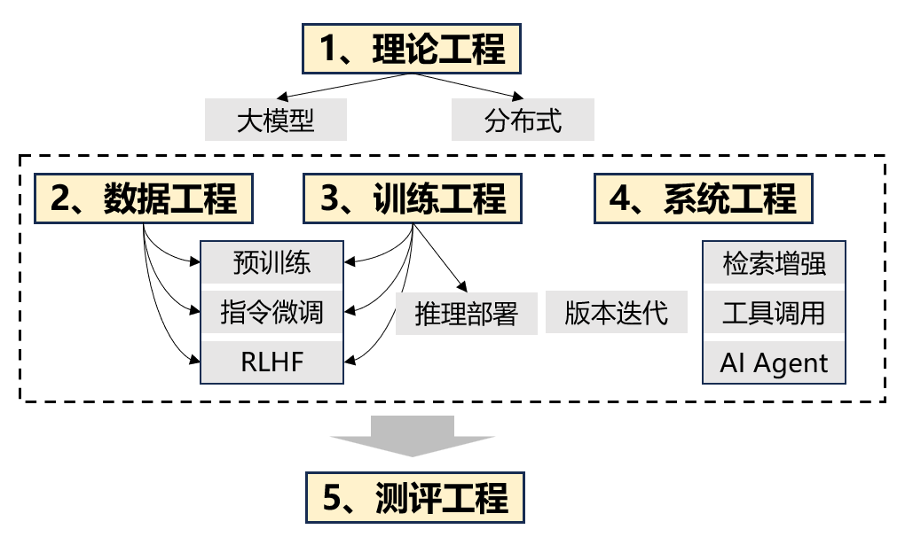

# 接地气的大模型工程
&emsp;&emsp;2022年底，由OpenAI发布的语言大模型ChatGPT引发了社会的广泛关注，ChatGPT能够通过自然语言交互完成多种任务，引发了AGI的曙光。当前大模型技术基本围绕
在由OpenAI在2022年发表的InstructGPT”预训练+指令微调+基于人类反馈的强化学习“技术范式，由于其ChatGPT具体细节未披露，以及大模型本身的可解释性存在
不足，当前大模型的实践工作，更像是一门工程科学，需要更多的工程和经验调优的能力来提升大模型的潜能。因此，将大模型作为一门实践工程，结合最新论文的实践和
我们的实践，试图解释和阐明大模型的工程细节。  
&emsp;&emsp;**本项目是大模型的端到端工程，用简练和实用的语言，争取成为一本大模型实战百科全书。**
项目共分为六个章节，理论工程阐述大模型技术中的重要理论基础，包括大模型架构和训练流程；数据工程阐述大模型每个阶段（预训练、指令微调、RLHF）的数据治理流程和质量评估指标；
训练工程阐述当前业界流行的各个阶段经典训练框架；系统工程阐述以大模型为入口的各种增强技术工程，同样以当前流行的框架以解释说明；测评工程阐述测评每个阶段的模型性能效果。
前沿展望阐述大模型的架构和训练机制的改进方向，以及大模型的应用落地中的思考。
***

**todo list**：  
1、0901-1001，完成章节基本框架搭建和初稿  
2、1001-1101，完成章节内容细化和图片设计

**欢迎交流**： 
个人邮箱：995622849@qq.com

