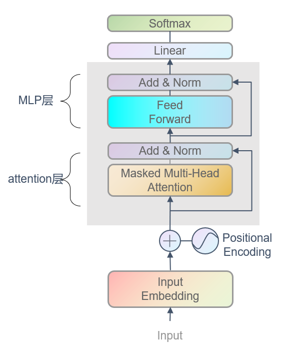
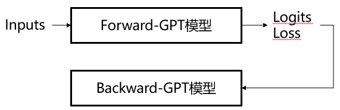

1.1.1 模型架构  
1.1.2 训练范式  
1.1.3 大模型-可解释*  
1.1.4 大模型-能力*  
1.1.5 大模型-缺陷*  
***
&emsp;&emsp;**大模型理论部分主要分为两个模块来介绍大模型的基础实现，其一是大模型架构的实现（model.py）；其二是模型训练流程的实现（train.py）。**
有了模型架构和训练实现两个步骤，我们就可以自定义训练任意大模型了。

### 1.1.1 模型架构
0、模型架构  
&emsp;&emsp;2014年Attention机制由Yoshua Bengio(LeNet作者)正式提出，2014-2017年Attention开枝散叶，逐渐成为了NLP中应用最广泛的设计；2017年NIPS"Attention
 is all you need"提出transformer的结构（设计self-attention,multi-head attention）直接使得Attention机制全面代替RNN，随着GPT系列仅采用Transformer中的
解码器部分，当前大模型更多指的是decoder-only架构，因此我们当前的理论实现均按照decoder-only（也叫做GPT）架构来进行说明展示。  
&emsp;&emsp;在这里主要参考由前特斯拉AI总监Andrej Karpathy发布<https://github.com/karpathy/nanoGPT>简易版大模型实现，GPT架构最重要的两个模块分别是attention层
和MLP层，代码架构实现较为清晰，后续的复杂大模型架构或者复杂训练流程其流程都一致。   
<p align="center">

</p>

1、attention层  
&emsp;&emsp;attention层是GPT架构的灵魂，attention机制听起来高大上，其关键就是学习到一个权重分布，本质也是特征提取器，由注意全部转移到注意局部中。构成
attention层有两个关键组件，其一是self-attention，其核心是加权求和代表特征，其二是multi-head，其核心是多维空间特征。  
**self-attention**：学习输出句子中每个词的重要程度（注意力权重分布），然后将其与每个词的value相乘，得到attention的输出。  
**multi-head**：允许模型在不同的子空间中学习相关的信息，主要目的是抽取更加丰富的特征。
```python
import math

import torch.nn as nn
import torch
from torch.nn import functional as F

class SelfAttention(nn.Module):
    def __init__(self, config):
        super().__init__()
        assert config.n_embd % config.n_head == 0
        # QKV投影矩阵
        self.c_attn = nn.Linear(config.n_embd, 3*config.n_embd, bias=config.bias)
        self.c_proj = nn.Linear(config.n_embd, config.n_embd, bias=config.bias)
        # 正则化
        self.attn_dropout = nn.Dropout(config.dropout)
        self.resid_dropout = nn.Dropout(config.dropout)

        self.n_head = config.n_head
        self.n_embd = config.n_embd
        self.dropout = config.dropout

        # flash attention
        self.flash = hasattr(torch.nn.functional, 'scaled_dot_product_attention')
        if not self.flash:
            print("WARNING:using slow attention. Flash Attention requires PyTorch >= 2.0")
            self.register_buffer("bias", torch.tril(torch.ones(config.block_size, config.block_size)).view(
                1,1,config.block_size,config.block_size
            ))

    def forward(self, x):
        # batch size, sequence length, embedding dimensionality
        B, T, C = x.size()

        # 计算多头的QKV
        q,k,v = self.c_attn(x).split(self.n_embd, dim=2)
        k = k.view(B, T, self.n_head, C//self.n_head).transpose(1,2)
        q = q.view(B, T, self.n_head, C // self.n_head).transpose(1, 2)
        v = v.view(B, T, self.n_head, C // self.n_head).transpose(1, 2)

        if self.flash:
            y = torch.nn.functional.scaled_dot_product_attention(q, k ,v, attn_mask=None,dropout_p=self.dropout if self.training else 0, is_causal=True)
        else:
            # 计算 attention score
            att = (q @ k.transpose(-2, -1)) * (1.0 / math.sqrt(k.size(-1)))
            att = att.masked_fill(self.bias[:,:,T,:T] == 0, float('-inf'))
            att = F.softmax(att, dim=-1)
            # 获得最终结果
            y = att @ v
        
        y = y.transpose(1,2).contiguous().view(B,T,C)
        y = self.resid_dropout(self.c_proj(y))
        return y
```
2、mlp层  
&emsp;&emsp;在attention层后的全连接反馈层（mlp层），mlp层同样由两个核心组件构成，这两个核心组件均为线性层，将attention层的输入先升维后降维，这样做的目的
让特征向量不同维度之间做充分的交叉，让模型能够抓取到更多的非线性特征和组合特征的信息。  
```python
class MLP(nn.Module):
    def __init__(self,config):
        super().__init__()
        # 升维
        self.c_fc = nn.Linear(config.n_embd, 4*config.n_embd, bias=config.bias)
        self.gelu = nn.GELU()
        # 降维
        self.c_proj = nn.Linear(4*config.n_embd, config.n_embd, bias=config.bias)

    def forward(self, x):
        x = self.c_fc(x)
        x = self.gelu(x)
        x = self.c_proj(x)
        x = self.dropout(x)
        return x
```
4、embedding层  
（1）字符编码  
&emsp;&emsp;字符编码基于Tokenizer分词器，Tokenizer的训练应用最广泛是BPE算法。  
（2）位置编码  
&emsp;&emsp;由于句子中每个单词同时通过Transformer的block块，因此模型本身对词的顺序没有自然的感知，所以需要一种方式词之间的顺序信息添加到模型中，当前经典的三种位置编码模式分别为：绝对位置编码、相对位置编码和旋转位置编码。  
-绝对位置编码易于理解和实现，一般通过正弦位置编码的方式实现，将位置编码直接嵌入到序列的表示中。  
-相对位置编码对平移不变性的模式识别能力较弱，一般将相对位置信息依赖集成到self-attention中提升transformer架构性能。  
-旋转位置编码兼具平移不变性和外推能力，通过绝对位置编码的方式实现相对位置编码编码。  
注：大模型外推性-外推性是指大模型在训练时和预测时的输入长度不一致，导致模型的泛化能力下降的问题。  
5、LayerNorm层  
&emsp;&emsp;语言模型的文本本质上可以看作一个时间序列，时间序列是不定长，长度不用的序列原则上术语不同的统计对象，所以很难得到稳定的统计量，而得不到稳定的统计量，BatchNorm就无法成立了。  
```python
class LayerNorm(nn.Module):
    def __init__(self, ndim, bias):
        super().__init__()
        self.weight = nn.Parameter(torch.ones(ndim))
        self.bias = nn.Parameter(torch.zeros(ndim)) if bias else None

    def forward(self, input):
        return F.layer_norm(input, self.weight.shape, self.weight, self.bias, 1e-5)
```
6、GPT架构  
&emsp;&emsp;attention和MLP是GPT的核心层，GPT整个架构的实现还需要一些其他层的实现，例如embedding和Layernorm等。
```python
class GPTArguments:
    block_size:int = 1024
    vocab_size:int = 10000
    n_layer:int = 12
    n_head:int = 12
    n_embd:int = 768
    dropout: float = 0.0
    bias: bool = True

class Block(nn.Module):
    def __init__(self, GPTArguments):
        super().__init__()
        self.ln_1 = LayerNorm(GPTArguments.n_embd, bias=GPTArguments.bias)
        self.attn = SelfAttention(config)
        self.ln_2 = LayerNorm(GPTArguments.n_embd, bias=GPTArguments.bias)
        self.mlp = MLP(config)

    def forward(self, x):
        x = x + self.attn(self.ln_1(x))
        x = x + self.mlp(self.ln_2(x))
        return x


class GPT(nn.Module):
    def __init__(self, config):
        super().__init__()
        assert config.vocab_size is not None
        assert config.block_size is not None
        self.config = config

        # GPT架构
        self.transformer = nn.ModuleDict(dict(
            wte = nn.Embedding(config.vocab_size, config.n_embd),
            wpe = nn.Embedding(config.block_size, config.n_embd),
            drop = nn.Dropout(config.dropout),
            h = nn.ModuleList([Block(config) for _ in range(config.n_layer)]),
            ln_f = LayerNorm(config.n_embd,bias=config.bias),
        ))
        self.lm_head = nn.Linear(config.n_embd, config.vocab_size, bias=False)
        self.transformer.wte.weight = self.lm_head.weight

    def forward(self, idx):
        device = idx.device
        b, t = idx.size()
        
        tok_emb = self.transformer.wte(idx)
        pos_emb = self.transformer.wpe(torch.arange(0, t, dtype=torch.long, device=device))
        x = self.transformer.drop(tok_emb+pos_emb)
        for block in self.transformer.h:
            x = block(x)
        x = self.transformer.ln_f(x)
        logits = self.lm_head(x)
        
        return logits
```

### 1.1.2 训练范式
&emsp;&emsp;实现模型架构之后，需要一个强大的trainer来训练模型架构中的参数权重，不同模型架构其训练流程基本一致，并且不论是预训练、指令微调
还是强化学习这三个阶段都是一个trainer进行参数权重的迭代更新，因此我们在复现别人的超大模型通常只需修改上述架构代码，训练流程核心不会变。大模型的本质就是神经网络
模型，因此大模型的训练流程同神经网络一样都是先进行前向传播，计算损失，然后反向传播，进行梯度更新。  
<p align="center">

</p>  

1、前向传播  
**定义**：
前向传播即从输入层到输出层：从输入层开始，经过层层layer，不断计算得到每一层神经网络的结果，最后得到输出的过程。前向传播有两个重要的输出值，一个是前向传播计算得到模型输出
logits，另一个就是损失值。  
损失函数定义：loss function用来度量模型的预测值和真实值的差异程度，包括基于距离度量的损失函数，基于距离的度量函数将输入数据映射到基于距离度量的特征空间上，
如欧式空间等，将映射后的样本看作空间上的点，采用合适的损失函数度量特征空间上样本真实值和预测值之间的距离，例如均方根误差损失函数、L2损失函数等；
基于概率分布度量的损失函数，基于概率分布度量的损失函数是将样本相似性转化为随机事件的可能性，即通过度量样本真实分布与它估计的分布之间的距离判断两者的相似度，
例如KL散度、交叉熵损失、softmax等。  
2、反向传播  
**定义**：
反向传播即根据损失函数来反方向地计算每一层的偏导数，从最后一层逐层向前更新每一层的权重。反向传播的过程核心是梯度下降算法。   
梯度下降定义：梯度下降是一个最优化算法，本质就是求解损失函数的极值，计算过程就是沿梯度下降的方向求解极小值。  

```python
class TrainingArguments():
    epoch: int = 1
    batch_size: int = 8
    learning_rate: float = 2e-5


class Trainer():
    def __init__(self, model, train_dataset):
        self.model = model
        self.train_dataset = train_dataset

    def train(self):
        # get_batch
        train_loader = torch.utils.data.DataLoader(
            self.train_dataset,
            sampler = torch.utils.data.RandomSampler(self.train_dataset, replacement=True, num_samples=int(1e10)),
            shuffle=True,
            pin_memory=True,
            batch_size = TrainingArguments.batch_size
        )
        data_iter = iter(train_loader)

        # optimizer
        optimizer = torch.optim.SGD(self.model.parameters(), TrainingArguments.learning_rate)
        criterion = nn.CrossEntropyLoss()

        # train_loop
        for epoch in range(TrainingArguments.epoch):
            while True:
                batch = next(data_iter)
                x, y = batch

                # forward前向传播
                pred = self.model(x)
                loss = criterion(pred,y)
                
                # backward反向传播
                optimizer.zero_grad()
                loss.backward()
                optimizer.step()
```

### 1.1.3 大模型-可解释*
&emsp;&emsp;大规模语言模型在自然语言处理方面展现出令人惊讶的推理能力，但其内在机理尚不清晰。随着大规模语言模型的广泛应用，阐明模型的运行机制对应用安全性、性能局限性
和可控的社会至关重要。本章节将以分解GPT架构的视角来解释最新的大模型可解释性方面的工作。  
***（1）方法论***  
&emsp;&emsp;在解释大模型的内在机理之前，首先需要了解当前大模型可解释性到底难在哪里？ 1）模型复杂度高，区别于LLM时代之前的深度学习模型或者传统的机器学习模型，LLMs模型规模巨大，包含数十亿个参数，其内部表示和推理过程非常复杂，很难针对其具体的输出给出解释。2）数据依赖性强，LLMs在训练过程中依赖大规模文本预料，这些训练数据中的偏见、错误等都可能影响模型，但很难完整判断训练数据的质量对模型的影响。3）黑箱性质，通常把LLM看作黑箱模型，很难显示地判断它的内部推理链和决策过程，只能根据输入输出进行分析。4）输出不确定性，LLM的输出常常存在不确定性，对同一输入可能产生不同的输出。5）评估指标不足，目前自动化评估指标还不足以完整反映模型的可解释性，需要更多考虑人类理解的评估指标。  
**基于传统fine-tune范式的模型解释**  
基于传统fine-tune范式的模型解释包括对单个预测的解释（局部解释）和对模型结构级别组分如神经元、网络层等的解释（全局解释）  
*局部解释*：局部解释对单个样本预测进行解释。其解释方法包括特征归因（feature attribution）、基于注意力机制的解释（attention-based）、基于样本的
解释（example-based）、基于自然语言的解释（natural language explanation）。  
--特征归因旨在衡量每个输入特征（例如单词、短语、文本范围）与模型预测的 相关性。特征归因方法可以分类为：基于扰动的解释，通过修改其中特定的输入特征观察对输
出结果的影响、基于梯度的解释，将输出对输入的偏微分作为相应输入的重要性 指标、替代模型，使用简单的人类可理解的模型去拟合复杂模型的单个输出，从而获取各输入
的重要性、基于分解的技术，旨在将特征相关性得分进行线性分解；  
--基于注意力的解释。注意力通常被作为一种关注输入中最相关部分的途径，因此注意力可能学习到可以用于解释预测的相关信息。常见的注意力相关的解释方法包括：
注意力可视化技术，直观地观察注意力分数在不同尺度上的变化、基于函数的解释，如输出对注意力的偏微分；  
--基于样本的解释从个例的角度对模型进行探测和解释，主要分为：对抗样本和反事实样本。对抗样本是针对模型对微小变动非常敏感的特性而生成的数据，自然语言处理
中通常通过修改文本得到，人类难以区别的文本变换通常会导致模型产生不同的预测。反事实样本则是通过将文本进行如否定的变形，通常也是对模型因果推断能力的检测。  
--自然语言解释使用原始文本和人工标记的解释进行模型训练，使得模型可以生成自然语言解释模型的决策过程。  
*全局解释*：全局解释旨在从模型构成的层面包括神经元，隐藏层和更大的组块，为大模型的工作机制提供更高阶的解释。主要探究在不同网络构成部分学习到的语义知识。  
--基于探针的解释，探针解释技术主要基于分类器进行探测，通过在预训练模型或者微调模型上训练一个浅层分类器，然后在一个holdout数据集上进行评估，使得分类器能
够识别语言特征或推理能力。  
--神经元激活 传统神经元激活分析只考虑一部分重要的神经元，在学习神经元与语义特性之间的关系。  
--基于概念的解释 将输入先映射到一组概念中，再通过测量概念对预测的重要性来对模型进行解释。  
**基于prompting范式的模型解释**  
需要对基础模型和助手模型分别解释以区别两种模型的能力，并探究模型学习的途径。其探究的问题主要包括：为模型提供解释对few-shot learning的益处；理解
few-shot learning和思维链能力的来源。  
*基础模型解释*：  
--解释对模型学习的好处，探究在few-shot learning的情况下解释是否对模型学习有帮助。  
--情境学习，探究情境学习在大模型中的作用机制，以区分情境学习在大模型和中等模型中的区别。  
--思维连，prompting探究思维链prompting提高模型表现得原因。  
*助手模型解释*：  
--Fine-tuning的角色，助手模型通常先经过预训练获得通用语义知识，在通过监督学习和强化学习获取领域内知识。而助手模型的知识主要来源于哪个阶段依然有待研究。  
--幻觉与不确定性，大模型预测的准确性和可信度依然是目前研究的重要课题。  
参考文献：  
[1] Zhao, Haiyan, et al. "Explainability for Large Language Models: A Survey." arXiv preprint arXiv:2309.01029 (2023).  

***（2）解释-GPT架构***  
&emsp;&emsp;2020年，MIT联合google证明Transformer结构的预测函数，在绝对位置编码下，对seq2seq函数是一个万能的逼近器。  
&emsp;&emsp;2022年，北大联合CMU证明Transformer结构的预测函数，在相对位置编码下，无论使用多深多宽的Transformer都无法逼近。  
参考文献：  
[1] Yun, Chulhee, et al. "Are transformers universal approximators of sequence-to-sequence functions?." arXiv preprint arXiv:1912.10077 (2019).  
[2]  Luo, Shengjie, et al. "Your transformer may not be as powerful as you expect." Advances in Neural Information Processing Systems 35 (2022): 4301-4315.  

***（3）解释-attention层***  
&emsp;&emsp;2023年5月25日，Meta公布了团队最新的成果，以数学严格方式，分析了1层Transformer（一个自注意力层加一个解码器层）在下一个token预测任务上的SGD训练动态。
这篇论文打开了自注意力层如何组合输入token动态过程的黑盒子，并揭示了潜在的归纳偏见性质。动态过程包含两个步骤scan和snap，
--scan 自注意力集中在key tokens上，即不同的、经常与下一个预测token同时出现的token；其他所有注意力都下降，频率偏差，模型会逐渐关注那些与query token
大量共现的key token，而对那些共现较少的token降低注意力。判别偏差，模型更关注那些在下一个要预测的token中唯一出现的独特token，而对那些在多个下一个token
中出现的通用token失去兴趣。这两个特性表明，自注意力隐式地运行时一种判别式扫描算法，并存在归纳偏差，即偏向于经常与qery token共同出现的独特token。
--snap 注意力权重几乎冻结，token组合固定，并变得稀疏。 
参考文献：  
[1] Tian, Yuandong, et al. "Scan and Snap: Understanding Training Dynamics and Token Composition in 1-layer Transformer." arXiv preprint arXiv:2305.16380 (2023).  

***（4）解释-MLP层***  
&emsp;&emsp;2020年，Transformer Feed-Forward Layers Are Key-Value Memories，之前大部分研究关注的是self-attention，而FF层占据了模型的2/3的参数，论文
有以下结论：FF层可以被视为一个key-value memory，其中每一层的key用于捕获输入序列的模式（浅层模式+语义模式）；value可以基于key捕获的模式，给出下
一个token的词表分布；每层的FF是由多个key-value组合而成，然后结合残差连接对每层的结果进行细化，最终产生模型的预测结果。  
2023年，Locating and Editing Factual Associations in GPT。众所周知，自回归语言模型里存储着大量的事实知识，比如语言模型可以正确的预测出埃菲尔铁塔
所在的城市是巴黎市。那么语言模型是在什么地方存储这些知识呢？我们是否可以修改存储在语言模型里的知识呢？基于因果追踪的结论以及过往的工作，作者提出了一种
存储事实知识的特定机制，早期的MLP模块进行知识检索，然后后期的注意力机制将累积的信息带到计算结束处来预测输出，因此事实知识主要存储在早期的MLP中。  
参考文献：  
[1] Geva, Mor, et al. "Transformer feed-forward layers are key-value memories." arXiv preprint arXiv:2012.14913 (2020).  

***（5）解释-神经元***  
&emsp;&emsp;2023年10月，Anthropic利用字典学习成功将大约500个神经元分解成了约4000个可解释特征，采用了一种稀疏自动编码器的弱字典学习算法，能够从经过训练
的模型生成学习特征，提供比模型神经元自身更单一的分析单元。  
参考文献：  
[1] https://transformer-circuits.pub/2023/monosemantic-features/index.html

### 1.1.4 大模型-能力*
***（1）参数量和计算量***  
GPT模型的层数为l，隐藏层维度为h
*参数量计算公式*  
-单个attention的模型参数由权重矩阵W`Q`\W`K`\W`V`\W`O`和偏置组成，4个权重矩阵的形状为[h,h]，4个偏置的形状为[h]。因此attention层的参数量为4h<sup>2</sup>+4h，近似等于4h<sup>2</sup>。  
-单个MLP的模型参数由2个线性层的权重和偏置组成。第一个线性层权重的形状为[h,4h]，偏置的形状为[4h]，第二个线性层权重的形状为[4h,h]，偏置的形状为[h]。因此MLP的参数量为8h<sup>2</sup>+5h，近似等于8h<sup>2</sup>。  
因此，**GPT模型的参数量为12<sup>2</sup>l**。  
*计算量计算公式*  
输入批次大小b，序列长度s
-单个attention的计算量是8bsh<sup>2</sup>+4bs<sup>2</sup>h。  
-单个MLP的计算量是16bsh<sup>2</sup>。
因此，**GPT模型的计算量为24bsh<sup>2</sup>l**。  
*参数量和计算量的关系*  
-在一次前向传递中，对于每个token，每个模型参数，需要进行2此浮点预算  
-后向传递的计算量是前向传递的2倍。  

***（2）scaling law***  
&emsp;&emsp;2020年，OpenAI在Scaling Laws for Neural Language Models揭示了大模型的scaling laws，有两个核心结论，核心结论一：模型表现和规模强相关（模型
参数量N、数据集大小D和计算量D）；和模型的shape弱相关（模型depth、width和多头个数），核心结论二：对于模型参数量N、数据集大小D和计算量C三个因素，如果
其他两个充足的前提下，模型表现和三个因素成幂方关系。  
&emsp;&emsp;2022年，Beyond the Imitation Game:Quantifying and extrapolating the capabilities of language models进一步分析大模型的scaling laws。
核心结论一：scaling按照任务不同分为三种类型，第一类任务随着模型规模逐渐增大，任务表现越来越好（知识密集任务）；第二类任务只有参数怒规模到达某个阈值，LLM
模型对（复杂推理类任务）出现突然的性能增长；随着模型规模增长，任务的效果曲线展现出U型特性（综合任务）。核心结论二：对于那些随着模型规模增大，效果一直下降的任务
，如果蚕蛹思维链（COT）Prompting,则部分任务的表现转化为遵循Scaling law，即模型规模越大效果越好，而其他人任务则转换为U型增长曲线。这其实侧面说明：此类
任务应属于推理类性的任务，所以加入CoT后任务表现会发生质的变化。  
参考文献：  
[1] Kaplan, Jared, et al. "Scaling laws for neural language models." arXiv preprint arXiv:2001.08361 (2020).  
[2] Srivastava, Aarohi, et al. "Beyond the imitation game: Quantifying and extrapolating the capabilities of language models." arXiv preprint arXiv:2206.04615 (2022).  

***（3）涌现机制***  
**现象**：  
&emsp;&emsp;2022年，google揭示目前两大类被认为是具有涌现能力，第一类是上下文学习In Context Learning而言，如果模型达到70B，大多任务可以具备涌现能力，第二类是
Chain of thought而言，如果模型达到50B，大多数任务可以具备涌现能力。  
**解释**： 
--解释一：任务的评价指标不够平滑。2023年，斯坦福大学、AssemblyAI均发表论文认为涌现机制出现与评价指标强相关，更换一些连续、平滑的指标，涌现现象就不那么明显，更接近于幂方关系。  
--解释二：复杂任务的涌现机制。2023年，google brain认为训练任务过于复杂，子任务符合幂方关系，但由于多个子任务构成，最终任务体现为涌现。  
参考文献：  
[1] Wei, Jason, et al. "Emergent abilities of large language models." arXiv preprint arXiv:2206.07682 (2022).  


### 1.1.5 大模型-缺陷*
***（1）幻觉***  
**定义**：当模型生成的文本不遵循原文（Faithfulness）或者不符合事实（Factualness），我们就认为模型出现了幻觉的问题。Faithfulness: 是否遵循input content; Factualness: 是否符合世界知识  
&emsp;&emsp;在传统任务里，幻觉大都指的是Faithfulness：Intrinsic Hallucination（信息冲突）：LLM在生成回复时，与输入信息产生了冲突，例如摘要问题里，abstract
和document的信息不一致；Extrinsic Hallucination（无中生有）：LLM在生成回复时，输出一些并没有体现在输入中的额外信息，比如邮箱地址、电话号码、住址，
并且难以验证其真假。面向LLM，我们通常考虑的幻觉是Factualness。  
**原因**：  
--数据层面：训练数据收集过程中，众包/爬虫检索的数据可能包含虚假信息，从而让模型记忆了错误的知识；过多的重复信息也可能会导致模型的知识记忆出现bias，从而导致幻觉
--模型层面：模型结构，如果是较弱的backbone可能会导致比较严重的幻觉问题；解码算法，如果使用不确定性较高的采样算法会诱导LLMs出现更严重的幻觉问题；暴露
偏差，训练和测试阶段不匹配的exposure bias问题可能会导致LLMs出现幻觉，特别是生成long-form response的时候；参数知识，LLMs在预训练阶段记忆的错误的
知识，会导致严重的幻觉问题。
**策略**：  
--基于数据的工作：构建高质量数据集，可以构建细粒度的幻觉评估benchmark用于分析幻觉的严重程度和原因；利用模型筛选出可能导致幻觉的数据并提出，预训练时给
更faithful的数据加权，或者不使用可靠来源的数据；
--基于模型的工作：模型结构层面的工作往往focus在设计更能充分编码利用soure information的方法，比如融入一些人类偏执，如GNN网络；或者在解码时减少模型
的生成随机性，因为diversity和Faithfulness往往是一个trade-off的关系，减少diversity/randomnessk可以变相提升Faithfulness/Factuality；检索
增强被证明是可以显著减少幻觉问题。  
--基于训练的工作：可控文本生成，将幻觉的程度作为一个可控的属性，利用可控文本生成技术进行控制；提前规划骨架再生成；强化学习，现有工作将减轻幻觉的指标作为
强化学习的reward函数，从而减轻幻觉现象；多任务学习，通过设计合适的额外任务，可以达到减轻幻觉的效果；后处理，设计一个小模型专门用于fix幻觉错误。

***（2）灾难性遗忘***  
--基于数据的工作：通用指令和领域指令混合训练，平行语料  
--基于模型的工作：高效微调技术，2023年2月贝壳全面对比了全参数微调和多种高效微调方式PEFT，得出结论：高效微调效果不如全参数微调；2023年3月清华提出：当基础模型规模增长
到一定程度，不同参数高效微调方法的性能差距缩小，且性能与全参数微调基本相当；  
--基于训练的工作：更大的模型，对于一个超大规模的预训练模型，如果模型在进行特定任务或给定特定的数据或样本时，模型仅有部分被激活，这个模型就是稀疏激活模型。
