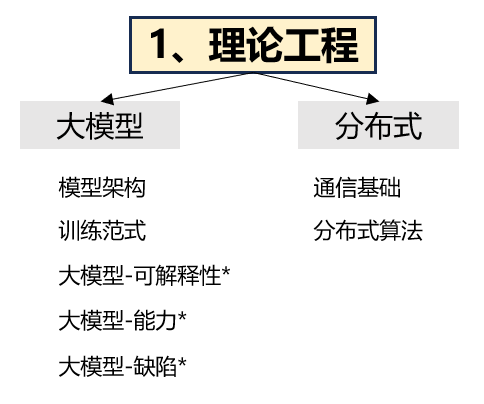

## 理论工程
&emsp;&emsp;OpenAI以及最近的”百模大战“对于语言大模型的研发工作主要是在Transformer架构推出后展开，形成了一系列技术进展。其中GPT-1探索了解码器
Transformer架构（decoder-only Transformer）在”预训练+微调“范式下的自然语言任务求解能力；GPT-2初步验证了扩大模型参数规模的有效性（扩展法则），
并且探索了基于自然语言提示的多任务解决能力；GPT-3首次探索了千亿参数规模的语言模型效果，提出了基于”上下文学习“的任务解决方案；CodeX使用代码数据对GPT-3
进行微调，从而提升代码能力和复杂推理能力；InstructGPT基于人类反馈强化学习技术（RLHF），能够强化对于人类指令的遵循能力和人类偏好的对齐能力；ChatGPT
与InstructGPT的技术原理相似，进一步引入了对话数据进行学习，从而加强了多轮对话能力。  
&emsp;&emsp;**随着GPT系列的成功，我们可以看到其理论本质有两点，其一是Transformer架构；其二是分布式**，因为指令微调和RLHF这两种对齐算法本质都是训练，
其训练原理内核都是神经网络的反向传播和分布式原理。因此我们将详细介绍这两个重要理论基础以及其pytorch实践。

