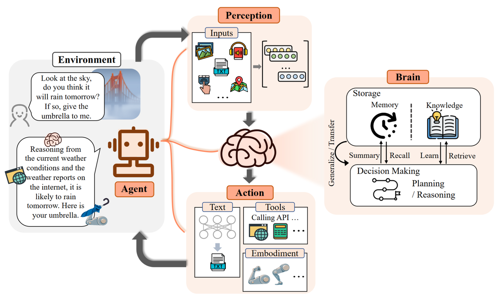

### 4.3.1 AI Agent
&emsp;&emsp;2023年9月复旦大学自然语言处理团队（FudanNLP）推出了LLM-based Agents综述论文，全面梳理了基于大型语言模型的智能代理现状，包括：LLM-based Agent的背景、构成、应用场景，以及备受关注的代理社会。  
**1、研究背景**  
&emsp;&emsp;长期以来，研究者们一直在追求与人类相当、乃至超越人类水平的通用人工智能（AGI）。早在1950年代，Alan Turing就将智能的概念扩展到了人工实体，并提出了著名的图灵测试。这些人工智能实体通常被称为——代理（Agent）。代理这一概念起源于哲学，描述了一种拥有欲望、信念、意图以及采取行动能力的实体。在人工智能这一领域，这一术语被赋予了一层新的含义：具有自主性、反应性、积极性和社交能力特征的智能实体。  
**2、Agent框架**  
&emsp;&emsp;智能代理的框架由三个部分组成：控制端（Brain）、感知端（Perception）和行动端（Action）。  

  

  

-**控制端**：通常由LLMs构成，是智能代理的核心。它不仅可以存储记忆和知识，还承担着信息处理、决策等不可获取的功能。它可以呈现推理和计划的功能，并很好地应对未知任务，反映出智能代理的泛化性和迁移性。  
控制端作为智能代理最核心的组成部分，从5个方面展开介绍其能力：
1）自然语言交互。语言是沟通的媒介，其中包含着丰富的信息。得益于 LLMs 强大的自然语言生成和理解能力，智能代理能够通过自然语言与外界进行多轮交互，进而实现目标。具体而言，可以分为两个方面：高质量文本生成：大量评估实验表明，LLMs 能够生成流畅、多样、新颖、可控的文本。尽管在个别语言上表现欠佳，但整体上具备良好的多语言能力。言外之意的理解：除了直观表现出的内容，语言背后可能还传递了说话者的意图、偏好等信息。言外之意有助于代理更高效地沟通与合作，大模型已经展现出了这方面的潜力。  
2）知识。基于大批量语料训练的 LLMs，拥有了存储海量知识（Knowledge）的能力。除了语言知识以外，常识知识和专业技能知识都是 LLM-based Agents 的重要组成部分。虽然 LLMs 其本身仍然存在知识过期、幻觉等问题，现有的一些研究通过知识编辑或调用外部知识库等方法，可以在一定程度上得到缓解。  
3）记忆。在本文框架中，记忆模块（Memory）储存了代理过往的观察、思考和行动序列。通过特定的记忆机制，代理可以有效地反思并应用先前的策略，使其借鉴过去的经验来适应陌生的环境。通常用于提升记忆能力的方法有三种：扩展 Backbone 架构的长度限制：针对 Transformers 固有的序列长度限制问题进行改进。总结记忆（Summarizing）：对记忆进行摘要总结，增强代理从记忆中提取关键细节的能力。压缩记忆（Compressing）：通过使用向量或适当的数据结构对记忆进行压缩，可以提高记忆检索效率。  
4）推理规划。推理能力（Reasoning）对于智能代理进行决策、分析等复杂任务而言至关重要。具体到 LLMs 上，就是以 思维链（Chain-of-Thought，CoT） 为代表的一系列提示方法。而规划（Planning）则是面对大型挑战时常用的策略。它帮助代理组织思维、设定目标并确定实现这些目标的步骤。在具体实现中，规划可以包含两个步骤：计划制定（Plan Formulation）：代理将复杂任务分解为更易于管理的子任务。例如：一次性分解再按顺序执行、逐步规划并执行、多路规划并选取最优路径等。在一些需要专业知识的场景中，代理可与特定领域的 Planner 模块集成，提升能力。计划反思（Plan Reflection）：在制定计划后，可以进行反思并评估其优劣。这种反思一般来自三个方面：借助内部反馈机制；与人类互动获得反馈；从环境中获得反馈。  
5）迁移性泛化性。对未知任务的泛化：随着模型规模与训练数据的增大，LLMs 在解决未知任务上涌现出了惊人的能力。通过指令微调的大模型在 zero-shot 测试中表现良好，在许多任务上都取得了不亚于专家模型的成绩。情景学习（In-context Learning）：大模型不仅能够从上下文的少量示例中进行类比学习，这种能力还可以扩展到文本以外的多模态场景，为代理在现实世界中的应用提供了更多可能性。持续学习（Continual Learning）：持续学习的主要挑战是灾难性遗忘，即当模型学习新任务时容易丢失过往任务中的知识。专有领域的智能代理应当尽量避免丢失通用领域的知识。  

-**感知端**：将智能代理的感知空间从纯文本拓展到包括文本、视觉和听觉等多模态领域，使代理能够更有效地从周围环境中获取与利用信息。  
人类通过多模态的方式感知世界，所以研究者们对 LLM-based Agents 抱有同样的期待。多模态感知能加深代理对工作环境的理解，显著提升了其通用性。  
1）文本输入：作为 LLMs 最基础的能力，这里不再赘述。  
2）视觉输入：LLMs 本身并不具备视觉的感知能力，只能理解离散的文本内容。而视觉输入通常包含有关世界的大量信息，包括对象的属性，空间关系，场景布局等等。常见的方法有：将视觉输入转为对应的文本描述（Image Captioning）：可以被 LLMs 直接理解，并且可解释性高。对视觉信息进行编码表示：以视觉基础模型 + LLMs 的范式来构成感知模块，通过对齐操作来让模型理解不同模态的内容，可以端到端的方式进行训练。  
3）听觉输入：听觉也是人类感知中的重要组成部分。由于 LLMs 有着优秀的工具调用能力，一个直观的想法就是：代理可以将 LLMs 作为控制枢纽，通过级联的方式调用现有的工具集或者专家模型，感知音频信息。此外，音频也可以通过频谱图（Spectrogram）的方式进行直观表示。频谱图可以作为平面图像来展示 2D 信息，因此，一些视觉的处理方法可以迁移到语音领域。  
4）其他输入：现实世界中的信息远不止文本、视觉和听觉。作者们希望在未来，智能代理能配备更丰富的感知模块，例如触觉、嗅觉等器官，用于获取目标物体更加丰富的属性。同时，代理也能对周围环境的温度、湿度和明暗程度有清楚的感受，采取更 Environment-aware 的行动。  
-**行动端**：除了常规的文本输入，还赋予代理具身能力、使用工具的能力，使其能够更好地适应环境变化，通过反馈与环境的交互，甚至能够塑造环境。  
在大脑做出分析、决策后，代理还需要做出行动以适应或改变环境： 
1）文本输出：作为 LLMs 最基础的能力，这里不再赘述。
2）工具使用：尽管 LLMs 拥有出色的知识储备和专业能力，但在面对具体问题时，也可能会出现鲁棒性问题、幻觉等一系列挑战。与此同时，工具作为使用者能力的扩展，可以在专业性、事实性、可解释性等方面提供帮助。例如，可以通过使用计算器来计算数学问题、使用搜索引擎来搜寻实时信息。  
3）具身行动：具身（Embodyment）是指代理与环境交互过程中，理解、改造环境并更新自身状态的能力。具身行动（Embodied Action）被视为虚拟智能与物理现实的互通桥梁。  

**3、应用场景**  
-**单代理场景**：可以接收人类自然语言指令，执行日常任务的智能代理，具有很高的现实实用价值。共分为三个层次：在任务导向的部署中，代理帮助人类用户处理日常基本任务。它们需要具备基本的指令理解、任务分解、与环境交互的能力。具体来说，根据现有的任务类型，代理的实际应用又可以分为模拟网络环境与模拟生活场景。在创新导向的部署中，代理能够在前沿科学领域展现出自主探究的潜力。虽然来自专业领域的固有复杂性和训练数据的缺乏给智能代理的构建带来了阻碍，但目前已经有许多工作在化学、材料、计算机等领域取得了进展。在生命周期导向的部署中，代理具备在一个开放世界中不断探索、学习和使用新技能，并长久生存的能力。在本节中，作者们以《我的世界》游戏为例展开介绍。由于游戏中的生存挑战可以被认为是现实世界的一个缩影，已经有许多研究者将其作为开发和测试代理综合能力的独特平台。  
-**多代理场景**：早在 1986 年，Marvin Minsky 就做出了具有前瞻性的预言。他在《心智社会》（The Society of Mind）一书中提出了一种新颖的智力理论，认为智力是在许多较小的、特定功能的代理的相互作用中产生的。例如，一些代理可能负责识别模式，而其他代理可能负责做出决策或生成解决方案。合作型互动：作为实际应用中部署最为广泛的类型，合作型的代理系统可以有效提高任务效率、共同改进决策。具体来说，根据合作形式的不同，作者们又将合作型互动细分为无序合作与有序合作。对抗型互动：智能代理以一种针锋相对（tit for tat）的方式进行互动。通过竞争、谈判、辩论的形式，代理抛弃原先可能错误的信念，对自己的行为或者推理过程进行有意义的反思，最终带来整个系统响应质量的提升。  
-**人机交互场景**：
参考文献：  
[1] Xi, Zhiheng, et al. "The rise and potential of large language model based agents: A survey." arXiv preprint arXiv:2309.07864 (2023).  

### 4.3.2 框架实战
斯坦福大学